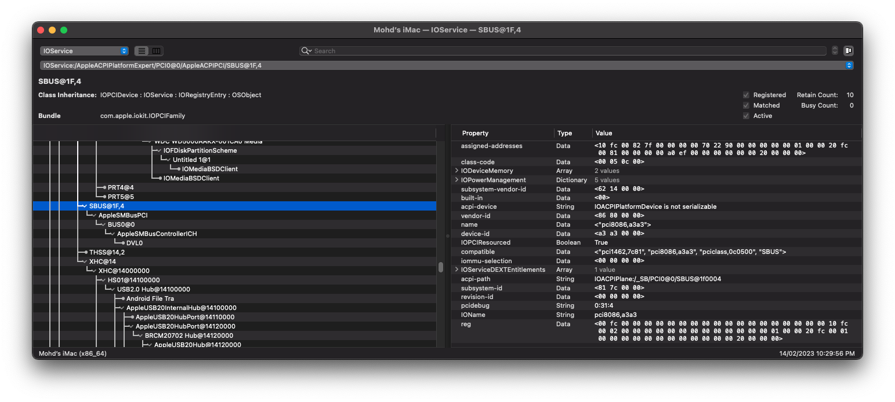

# Fix SBUS and MCHC

## Introduction

The System Management Bus (abbreviated to `SBUS`, `SMBus` or `SMB`) is a single-ended simple two-wire bus for the purpose of lightweight communication. Most commonly it is found in computer motherboards for communication with the power source for `ON/OFF` instructions.

`MCHC` is Memory Controller Hub Component has a data stream controller adapted to use a system memory to store graphics data and to control functions of the system memory, a processor interface, a system memory interface, a graphics subsystem coupled to the data stream controller and adapted to perform graphics operations on graphics data, and a graphics port adapted to couple the memory controller hub to an external graphics device.

### Differencies

- Generic PC (400 Series)

```asl
Device (_SB)
{
    Device(SBUS)
    {
        Name (_ADR, 0x001F0004)  // _ADR: Address
        Method (_DSM, 4, Serialized)  // _DSM: Device-Specific Method
        {
            If (PCIC (Arg0))
            {
                Return (PCID (Arg0, Arg1, Arg2, Arg3))
            }

            Return (Buffer (One)
            {
                 0x00
            })
        }
    }
}
```

> **Note**: Simple, but not working on Mac.

- Real Mac (iMac19,1)

```asl
Device (_SB)
{
    Device (SBUS)
    {
        Name (_ADR, 0x001F0004)  // _ADR: Address
        OperationRegion (SMBP, PCI_Config, 0x40, 0xC0)
        Field (SMBP, DWordAcc, NoLock, Preserve)
        {
                ,   2, 
            I2CE,   1
        }

        OperationRegion (SMPB, PCI_Config, 0x20, 0x04)
        Field (SMPB, DWordAcc, NoLock, Preserve)
        {
                ,   5, 
            SBAR,   11
        }

        bla...bla..bla..
```

> **Note**: Similar, but complicated.

### SBUS and MCHC Fix

```asl
DefinitionBlock ("", "SSDT", 2, "CpyPst", "SBUSMCHC", 0x00010000)
{
    External (_SB_.PCI0, DeviceObj)
    External (_SB_.PCI0.SBUS, DeviceObj)

    Scope (\_SB)
    {
        If (_OSI ("Darwin"))
        {
            Scope (PCI0)
            {
                Device (MCHC)
                {
                    Name (_ADR, Zero)  // _ADR: Address
                }

                Scope (SBUS)
                {
                    Device (BUS0)
                    {
                        Name (_ADR, Zero)  // _ADR: Address
                        Name (_CID, "smbus")  // _CID: Compatible ID
                        Device (DVL0)
                        {
                            Name (_ADR, 0x57)  // _ADR: Address
                            Name (_CID, "diagsvault")  // _CID: Compatible ID
                            Method (_DSM, 4, NotSerialized)  // _DSM: Device-Specific Method
                        }

                        Method (_STA, 0, NotSerialized)  // _STA: Status
                        {
                            Return (0x0F)
                        }
                    }
                }
            }
        }
    }
}
```

### Results

