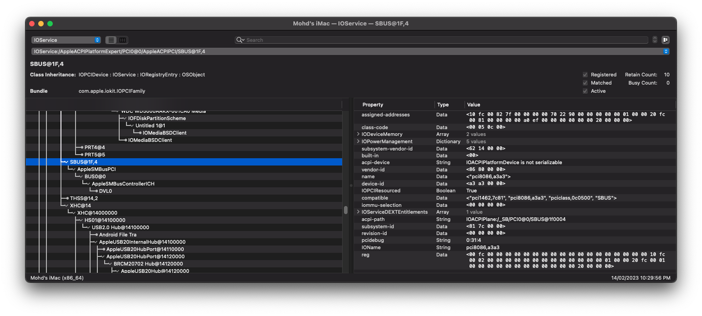

# Fix SBUS and MCHC


Table of contents

- [Introduction](#introduction)
- [Credits](#credits)

## Introduction

<div align="justify">The System Management Bus ;abbreviated to <b>SBUS</b>, <b>SMBus</b> or <b>SMB</b> is a single-ended simple two-wire bus for the purpose of lightweight communication. Most commonly it is found in computer motherboards for communication with the power source for <code>ON</code> & <code>OFF</code> instructions, while <code>MCHC</code>, is Memory Controller Hub Component has a data stream controller adapted to use a system memory to store graphics data and to control functions of the system memory, a processor interface, a system memory interface, a graphics subsystem coupled to the data stream controller and adapted to perform graphics operations on graphics data, and a graphics port adapted to couple the memory controller hub to an external graphics device.</div>

### Fixing SBUS

<div align="justify">There is no auto-generated SSDT that can compile MCHC and SBUS. Here, we need to do this manually. Head to <a href="https://dortania.github.io/Getting-Started-With-ACPI/Universal/smbus.html">Dortania SMBus Support</a>
. Do note that fixing SMBus or SBus is sometimes not required due to differences in architecture. If Ioreg properly showing an address, master (SMBUS + AppleSMBusPCI), host (BUS0 + AppleSMBusControllerICH) and slave (BLC0/DVL0/any name), consider we don't need this fix.</div>

### Enhancement

> **Note:** This enhancement can only be use on 10th Gen Hackintosh.

<div align="justify">SMBus (System Management Bus) is based on the I2C protocol, and is mostly a subset of I2C protocols and signaling. Many I2C devices will work on an SMBus, but some SMBus protocols add semantics beyond what is required to achieve I2C branding. Modern PC mainboards rely on SMBus. The most common devices connected through SMBus are RAM modules configured using I2C EEPROMs, and hardware monitoring chips. Because the SMBus is mostly a subset of the generalized I2C bus, we can use its protocols on many I2C systems. However, there are systems that don’t meet both SMBus and I2C electrical constraints; and others which can’t implement all the common SMBus protocol semantics or messages.</div>

**References:** 
<a href="https://www.kernel.org/doc/html/latest/i2c/summary.html#:~:text=SMBus%20%28System%20Management%20Bus%29%20is%20based%20on%20the,I2C%20branding.%20Modern%20PC%20mainboards%20rely%20on%20SMBus.">https://www.kernel.org</a>

Below is our template to enhance SMBus. Copy this template and generate it as an SSDT (.aml).

```asl
DefinitionBlock ("", "SSDT", 2, "SBUSv1", "Younix", 0x00001003)
{
    External (_SB_.PCI0, DeviceObj)
    External (_SB_.PCI0.SBUS, DeviceObj)

    Scope (\_SB)
    {
        If (_OSI ("Darwin"))
        {
            Scope (PCI0)
            {
                Scope (SBUS)
                {
                    Device (BUS0)
                    {
                        Name (_CID, "smbus")
                        Name (_ADR, Zero)
                        Device (DVL0)
                        {
                            Name (_ADR, 0x57)
                            Name (_CID, "diagsvault")
                            Method (_DSM, 4, NotSerialized)
                            {
                                If (!Arg2)
                                {
                                    Return (Buffer ()
                                    {
                                         0x57
                                    })
                                }

                                Return (Package ()
                                {
                                    "address", 
                                    0x57, 
                                    "command", 
                                    Zero, 
                                    "fault-len", 
                                    0x04, 
                                    "fault-off", 
                                    0x03, 
                                    "refnum", 
                                    Zero, 
                                    "type", 
                                    0x49324300, 
                                    "version", 
                                    0x03
                                })
                            }
                        }

                        Method (_STA, 0, NotSerialized)  // _STA: Status
                        {
                            Return (0x0F)
                        }
                    }
                }
            }
        }
    }
}
```

This is my optimised code, but still don't have time to test.

```asl
DefinitionBlock ("", "SSDT", 2, "SBUSv2", "Younix", 0x00001004)
{
    External (_SB_.PCI0, DeviceObj)
    External (_SB_.PCI0.SBUS, DeviceObj)

    Scope(\_SB)
    {
        If (_OSI ("Darwin"))
        {
            Scope(PCI0)
            {
                Scope(SBUS)
                {
                    Device(BUS0)
                    {
                        Name(_ADR, Zero)
                        Name(_CID, "smbus")
                        Device(DVL0)
                        {
                            Name(_ADR, 0x57)
                            Name(_CID, "diagsvault")
                            Method(_DSM, 4, NotSerialized)
                            {
                               /* The _DSM method can be simplified by returning a Package directly instead 
                                * of using an "If" statement to check for the Arg2 parameter. Since Arg2 is
                                * not used in this method, this check is unnecessary */
                                Return(Package()
                                {
                                   /* Remove the fault-len and fault-off keys. These keys are used for error
                                    * reporting and are not necessary for the operation of the device. Removing
                                    * them can simplify the code and reduce the SSDT size */
                                    "command", Zero,
                                    "refnum", Zero,
                                    "type", 0x49324300,
                                    "version", 0x03
                                })
                            }
                        }

                        Method(_STA, 0, NotSerialized)
                        {
                            Return(0x0F)
                        }
                    }
                }
            }
        }
    }
}
```
 


## Credits

[Acidanthera](https://github.com/acidanthera/) | [Dortania](https://github.com/dortania) | [khronokernel](https://github.com/khronokernel)
