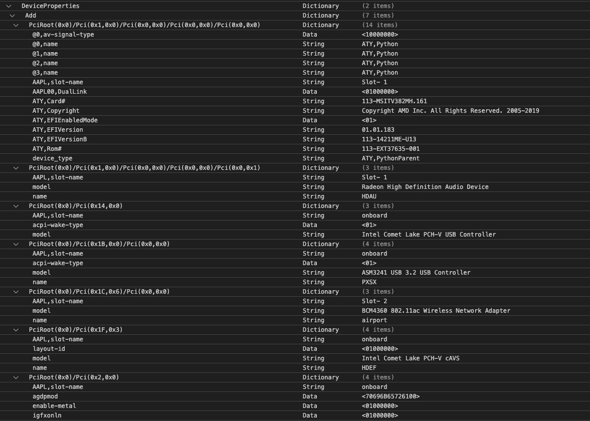

# MSI MAG B460 TOMAHAWK

Table of contents:

- [Introduction](#introduction)
- [About this build](#about-this-build)
- [Kexts Used](#kext-used)
- [Changelog](#changelog)
- [Credits](#credits)

## Introduction

**Author:** This is my EFI from a previous version of my Hackintosh desktop. The construction isn't ideal, but it does the job. Never blame me if there is an issue or malfunction.   Although this project carries some risk. Please read Dortania's official documents and my explanations for about this build, then shouldn't have any issues. Please do so at your own risk. Below are the best references you should read:

- [Dortania's OpenCore Install Guide](https://dortania.github.io/OpenCore-Install-Guide/) - Official
- [Dortania's Announcement](https://dortania.github.io/) - Official
- [OC Little Translate](https://github.com/5T33Z0/OC-Little-Translated) - 3rd Party References

> **Note**: This build has been tested on Linux, MacOS, and Windows.

## About this build

- **Out of the box**
  - ASM3241 USB 3.2 Host Controller.
  - 400 Series Chipset Family SATA AHCI Controller.
  - BCM4360 802.11ac Wireless Network Adapter.
  - Kingston A2000 NVMe SSD1.
  - Kingston A2000 NVMe SSD2.
  - Navi 10 HDMI Audio.

- **Non-Native**
  - Comet Lake PCH-V Converged Audio Voice Speech. Require [AppleALC](https://github.com/acidanthera/AppleALC).
  - Comet Lake PCH-V SMBus Host Controller. Require ACPI (SSDT) Patch. Also known as SSDT-SBUS.
  - Comet Lake PCH-V USB Controller. Require [USBMap](https://github.com/USBToolBox/tool) Port Mapping.
  - Comet Lake-S 6c Host Bridge/DRAM Controller. Require ACPI (SSDT) Patch. Also known as SSDT-MCHC.
  - Ethernet Connection (11) I219-V. Require [IntelMausi](https://github.com/acidanthera/IntelMausi).
  - Intel UHD Graphics 630 Headless. Require DeviceProperties Patch. (`agdpmod` = `pikera` / `agdpmod` = `70696B65726100`)
  - Navi 14 Radeon RX 5500 XT. Require DeviceProperties Patch & [WhateverGreen](https://github.com/acidanthera/WhateverGreen).
  - RTL8125 2.5GbE Controller. Require [LucyRTL8125Ethernet](https://github.com/Mieze/LucyRTL8125Ethernet).

  

## Kexts Used

- [AppleALC](https://github.com/acidanthera/AppleALC)
- [IntelMausi](https://github.com/acidanthera/IntelMausi)
- [Lilu](https://github.com/acidanthera/Lilu)
- [LucyRTL8125Ethernet](https://github.com/Mieze/LucyRTL8125Ethernet)
- [RestrictEvents.kext](https://github.com/acidanthera/RestrictEvents) To disables uninitialized disk warning in Finder
- [RadeonSensor.kext](https://github.com/aluveitie/RadeonSensor)
- [SMCRadeonGPU.kext](https://github.com/aluveitie/RadeonSensor) RadeonSensor Plugin
- [SMCProcessor](https://github.com/acidanthera/VirtualSMC) VirtualSMC Plugin
- [SMCSuperIO](https://github.com/acidanthera/VirtualSMC) VirtualSMC Plugin
- [USBMap](https://github.com/USBToolBox/tool)
- [VirtualSMC](https://github.com/acidanthera/VirtualSMC)
- [WhateverGreen](https://github.com/acidanthera/WhateverGreen)

> **Note**: Check out `release` and `debug` kext [here](https://dortania.github.io/builds/)

## Changelog

- May 14, 2023 2:44 PM [OC](https://github.com/acidanthera/OpenCorePkg) [0.9.2](https://github.com/acidanthera/OpenCorePkg/releases)

**Big Sur, Monterey, Ventura :**
  
- Add `RestrictEvents.kext`. Refer `4D1FDA02-38C7-4A6A-9CC6-4BCCA8B30102` / `revpatch`  / `diskread` to disables uninitialized disk warning in Finder. ie: swap (linux) via config.plist.
- Add NVMe/SSD Trim patch (default is disable)
- Clean and Optimised ACPI code.
- Desktop `Quirks` presets.
- iMac20,1 SMBIOS.
- MinDate and MinVersion is set to `0`.
- OpenCore `v0.9.2`.
- Without `plugin-type 1`. XCPM is enable by default. Refer: <https://github.com/acidanthera/bugtracker/issues/2013>

**Catalina :**
  
- Add `RestrictEvents.kext`. Refer `4D1FDA02-38C7-4A6A-9CC6-4BCCA8B30102` / `revpatch`  / `diskread` to disables uninitialized disk warning in Finder. ie: swap (linux) via config.plist.
- Add NVMe/SSD Trim patch (default is enable)
- Clean and Optimised ACPI code.
- Desktop `Quirks` presets.
- iMac20,1 SMBIOS.
- MinDate and MinVersion is set to `-1`.
- OpenCore `v0.9.2`.
- USB Port LImit Removal (10.15.X). Useful for performing USB Port Mapping (Post Process)
- With `plugin-type 1` to enable native XCPM.

## Credits

[Acidanthera](https://github.com/acidanthera/) ⌘ [corpnewt](https://github.com/corpnewt) ⌘ [Dortania](https://github.com/dortania) ⌘ [khronokernel](https://github.com/khronokernel) ⌘ [tomeko.net](http://tomeko.net/index.php?lang=en) ⌘ [sqlec](https://apple.sqlsec.com/6-%E5%AE%9E%E7%94%A8%E5%A7%BF%E5%8A%BF/)
