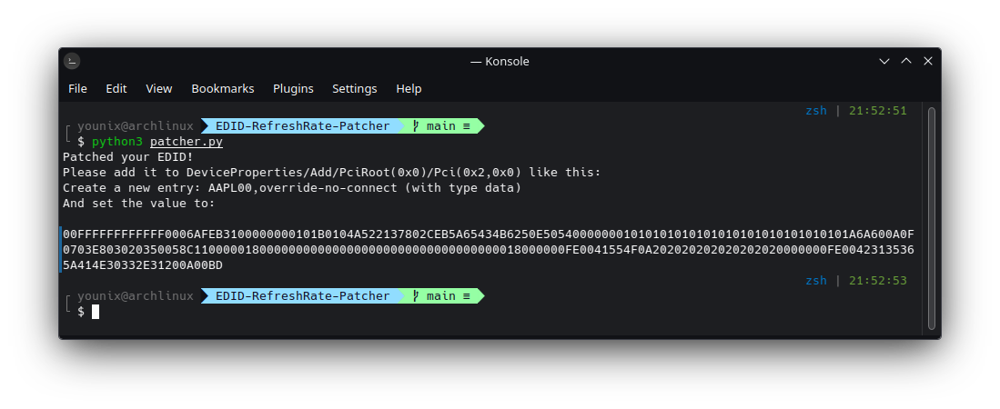

# iHack MSI MAG B460 Tomahawk


[](https://github.com/theofficialcopypaste/ASRockB460MSL-OC/releases)
[](https://www.apple.com/ge/macos/monterey/)
[](https://www.apple.com/my/macos/ventura/)
[](https://github.com/acidanthera/OpenCorePkg/releases)

Table of contents

- [Introduction](#introduction)
  - [Devices](#devices)
  - [Plist Configuration](#plist-configuration)
  - [Changelog](#changelog)
- [Guide and Samples](#guide-and-samples)
- [Credits](#credits)

## Introduction

This is my current EFI clone that I built according to my hardware. Feel free to read my content. If you have a similar build but different settings, you might consider checking this out. Before read, below is the best way to checkout the latest OpenCore guide and news.

- [Dortania](https://dortania.github.io/OpenCore-Install-Guide/) Getting Started.
- Checkout latest [post](https://dortania.github.io), news and update directly from developer.

> **Reminder**: Since my build boot only Linux and macOS, my ACPI code would be less / different (lack of `Else`, `Zero` and `0x0F` methods), and may cause an issue in booting Windows. If you need help or ACPI related issue in dual- or multiple-booting, especially Windows; add `Zero` and `0xFF` method to patched device as example below:

**Enable Device on Darwin Kernel:**

```asl
Device(XXXX) {
    Name CID / HID / ADR / XXX
    Method(_XXX, 0, NotSerialized) // _STA: Status
    {
        If(_OSI("Darwin")) {
            Return(0x0F) //  Enable
        }
        Else {
            Return(Zero) //  Disable
        }
    }
}
```

**Disable Device on Darwin Kernel:**

```asl
Device(XXXX) {
    Name CID / HID / ADR / XXX
    Method(_XXX, 0, NotSerialized) // _STA: Status
    {
        If(_OSI("Darwin")) {
            Return(Zero) //  Disable
        }
        Else {
            Return(0x0F) //  Enable
        }
    }
}
```

### Devices

- **Untouched**
  - 400 Series Chipset Family SATA AHCI Controller
  - 6th-10th Gen Core Processor PCIe Controller (x16)
  - B460 Chipset LPC/eSPI Controller
  - Cannon Lake PCH Power Management Controller
  - Comet Lake PCH-V HECI Controller
  - Comet Lake PCI Express Root Port #03
  - Comet Lake PCI Express Root Port #05
  - Comet Lake PCI Express Root Port #07
  - Comet Lake PCI Express Root Port #09
  - Comet Lake PCI Express Root Port #19
  - Comet Lake PCI Express Root Port #21
  - Navi 10 XL Upstream Port of PCI Express Switch

> **Note**: Device above is untouched, no acpi, kext and config.plist **patch** required.

- **Touched**
  - ASM3241 USB 3.2 Host Controller
  - BCM4360 802.11ac Wireless Network Adapter
  - Comet Lake PCH-V cAVS
  - Comet Lake PCH-V SMBus Host Controller
  - Comet Lake PCH-V Thermal Subsystem
  - Comet Lake PCH-V USB Controller
  - Comet Lake-S 6c Host Bridge/DRAM Controller
  - Ethernet Connection (11) I219-V
  - Intel CoffeeLake-H GT2 (UHD Graphics 630 Headless)
  - Kingston A2000 NVMe SSD1
  - Kingston A2000 NVMe SSD2
  - Navi 10 HDMI Audio
  - Navi 10 XL Downstream Port of PCI Express Switch
  - Navi 14 Radeon RX 5500/5500M / Pro 5500M
  - RTL8125 2.5GbE Controller
  - VL805/806 xHCI USB 3.0 Controller
  - Xeon E3-1200 v5/v6 / E3-1500 v5 / 6th/7th/8th Gen

### Plist Configuration

Settings should be based on the type of CPU, motherboard, and GPU. This is a Comet Lake, B460, and AMD Navi 14 configuration via `config.plist`.

- **ACPI**

  - Check out my [sample](Guide%20&%20Samples/ACPI%20Samples/SSDT-MSIB460.dsl).

- **Booter**

  - Quirks
  
    - AvoidRuntimeDefrag - boolean - `Yes`
    - DevirtualiseMmio - boolean - `Yes`
    - EnableSafeModeSlide - boolean - `Yes`
    - ProvideCustomSlide - boolean - `Yes`
    - SyncRuntimePermissions - boolean - `Yes`
    - ProvideMaxSlide - number - `0`
    - ResizeAppleGpuBars - number - `-1` (2020+ BIOS Notes: When enabling Above4G, Resizable BAR Support may become an available on some Z490 and newer motherboards. Please ensure that Booter -> Quirks -> ResizeAppleGpuBars is set to `0` if this is enabled.)
  
  > **Note**: Other than above is `No`

- **DeviceProperties**

  Use Linux to configure proper slot:

  `sudo dmidecode` or `sudo dmidecode -t 9 |awk '/ID:/ {id=$2} /Bus Address/ {print "Slot",id+1,"PCIe",$3}'`

  **Results:**

  - PciRoot(0x0)/Pci(0x1,0x0)/Pci(0x0,0x0)/Pci(0x0,0x0)/Pci(0x0,0x0)
  
    - `@0,name` - string - `ATY,Python`
    - `@1,name` - string - `ATY,Python`
    - `@2,name` - string - `ATY,Python`
    - `@3,name` - string - `ATY,Python`
    - `AAPL,slot-name` - string - `J6B2`
    - `AAPL00,override-no-connect` - data - `Your dumped EDID from Linux` (Optional)
    - `ATY,EFIVersion` - string - `31.0.120.26.3`
    - `device_type` - string - `ATY,PythonParent`

  To patch `AAPL00,override-no-connect`, grab [edid-refreshrate-patcher](https://github.com/iamyounix/edid-refreshrate-patcher) using Linux and follow instruction below. We will assume downloaded file & folder is in Desktop.

  ```zsh
  cd /home/yourname/Desktop/EDID-RefreshRate-Patcher && python3 patcher.py
  ```

  

  Copy generated EDID to `AAPL00,override-no-connect` - data. Below is an example:

  **Results:**

  `AAPL00,override-no-connect` - data - `00FFFFFFFFFFFF0006AFEB3100000000101B0104A522137802CEB5A65434B6250E505400000001010101010101010101010101010101A6A600A0F0703E803020350058C110000018000000000000000000000000000000000018000000FE0041554F0A202020202020202020000000FE00423135365A414E30332E31200A00BD`

  - PciRoot(0x0)/Pci(0x1,0x0)/Pci(0x0,0x0)/Pci(0x0,0x0)/Pci(0x0,0x1)
  
    - `AAPL,slot-name` - string - `J6B2`
    - `model` - string - `Navi 10 HDMI Audio`
  
  - PciRoot(0x0)/Pci(0x14,0x0)
  
    - `AAPL,slot-name` - string - `Onboard`
    - `acpi-wake-type` - data - `01`
    - `model` - string - `Comet Lake PCH-V USB Controller`
  
  - PciRoot(0x0)/Pci(0x1B,0x0)/Pci(0x0,0x0)
  
    - `AAPL,slot-name` - string - `Onboard`
    - `acpi-wake-type` - data - `01`
    - `model` - string `ASM3241 USB 3.2 USB Controller`
  
  - PciRoot(0x0)/Pci(0x1C,0x4)/Pci(0x0,0x0)
  
    - `AAPL,slot-name` - string - `J6D1`
    - `acpi-wake-type` - data - `01`
    - `model` - string - `VL805/806 USB 3.0 Controller`
  
  - PciRoot(0x0)/Pci(0x1C,0x6)/Pci(0x0,0x0)
  
    - `AAPL,slot-name` - string - `J8B4`
    - `model` - string - `BCM4360 802.11ac Wireless Network Adapter`
  
  - PciRoot(0x0)/Pci(0x1F,0x3)
  
    - `AAPL,slot-name` - string - `Onboard`
    - `layout-id` - data - `01000000`
    - `model` - string - `Comet Lake PCH-V Converged Audio Voice Speech`
  
  - PciRoot(0x0)/Pci(0x2,0x0)
  
    - `AAPL,ig-platform-id` - data - `0300923E`
    - `AAPL,slot-name` - string - `Onboard`
    - `agdpmod` - data - `70696B65726100`
    - `device-id` - data - `9B3E0000`
    - `enable-metal` - data - `01000000`
    - `igfxfw` - data - `02000000`
    - `igfxonln` - data - `01000000`

> **Note**: Check device properties in plist layout [here](Device%20Properties/deviceproperties.plist)

- **Kext**

  - Add
  
    - [x] [AppleALC](Kexts/AppleALC.kext)
    - [x] [IntelMausi](Kexts/IntelMausi.kext)
    - [x] [Lilu](Kexts/Lilu.kext)
    - [x] [LucyRTL8125Ethernet](Kexts/LucyRTL8125Ethernet.kext)
    - [x] [SMCProcessor](Kexts/SMCProcessor.kext)
    - [x] [SMCSuperIO](Kexts/SMCSuperIO.kext)
    - [x] [USBMap](Kexts/USBMap.kext)
    - [x] [VirtualSMC](Kexts/VirtualSMC.kext)
    - [x] [WhateverGreen](Kexts/WhateverGreen.kext)

  > **Note**: Others than above should remain as empty

- Quirks
  
  - AppleXcpmCfgLock - boolean - `Yes`
  - DisableIoMapper - boolean - `Yes`
  - PanicNoKextDump - boolean - `Yes`
  - PowerTimeoutKernelPanic - boolean - `Yes`
  - SetApfsTrimTimeout - number - `0`

  > **Note**: Others than shall remain as `No`

- **Misc**

  - ConsoleAttributes - boolean - `Yes`
  - HibernateMode - boolean - `Yes`
  - HideAuxiliary - string - `Auto`
  - LauncherOption - string - `Full`
  - LauncherPath - string - `Default`
  - PickerAttributes - number - `147`
  - PickerMode - string - `External`
  - PickerVariant - string - `Acidanthera\GoldenGate` or `your custom theme`
  - ShowPicker - boolean - `Yes`
  - TakeoffDelay - number - `0`
  - Timeout - number - `5`

  > **Note**: Other than above is `No`

- **PlatformInfo**

  - SMBIOS: [iMac20,1](https://everymac.com/ultimate-mac-lookup/?search_keywords=iMac20,1)

  > **Note**: Refer real iMac20,1 Apple. Inc [BIOS Vendor](BIOS/BIOSVendor:%20%22Apple%20Inc.%22.yml)

- **UEFI**

  - APFS
  
    - EnableJumpstart - boolean - `Yes`
    - HideVerbose - boolean - `Yes`
    - MinDate - number - `0` (use `-1` for Catalina)
    - MinVolume - number - `0` (use `-1` for Catalina)
  
  - Drivers
  
    - Path - boolean - `HFSPlus.efi`
    - Path - boolean - `OpenRuntime.efi`
    - Path - boolean - `HFSPlus.efi`
    - Path - boolean - `ResetNvramEntry.efi`

  > **Note**: Enable - `boolean` all driver as `Yes`

  - Input
  
    - KeyForgetThreshold - number - `5`
    - LeySupport - boolean - `Yes`
    - KeySupportMode - boolean - `Auto`
    - PointerSupportMode - string - `ASUS`
    - TimerResolution - number - `50000`

  > **Note**: Other than above is `No`

  - Output
  
    - GopPassThrough - string - `Disable`
    - ProvideConsoleGop - boolean - `Yes`
    - Resolution - string - `max`
    - TextRenderer - string - `BuiltinGraphics`
    - UIScale - number - `-1`

  > **Note**: Other than above is `No`

  - ProtocolOverrides
  
    - FirmwareVolume - boolean - `Yes`

  > **Note**: Other than above is `No`

  - Quirks
  
    - EnableVectorAcceleration - boolean - `Yes`
    - ExitBootServicesDelay - number - `0`
    - RequestBootVarRouting - boolean - `Yes`
    - ResizeGpuBars - number - `-1`
    - TscSyncTimeout - number - `0`

  > **Note**: Other than above is `No`

### Changelog

- March 11, 2023 6:19 AM [OC](https://github.com/acidanthera/OpenCorePkg) ver: [0.9.0](https://github.com/acidanthera/OpenCorePkg/releases)

  - [x] Add fake FWHD (only run on macOS)
  - [x] Clean ACPI code

## Guide and Samples

- Guide

  - [Ambient Light Sensors](Guide%20&%20Samples/Ambient%20Light%20Sensors/Ambient%20Light%20Sensors.md)
  - [Fix SBUS and MCHC](Guide%20&%20Samples/Fix%20SBUS%20and%20MCHC/Fix%20SBUS%20and%20MCHC.md)
  - [Fix USB Wake](Guide%20&%20Samples/USB%20Devices%20Related%20Fix/Fix%20USB%20Wake.md)
  - [Migrate EFI Properties](Guide%20&%20Samples/Migrate%20EFI%20Properties/Migrate%20EFI%20Properties.md)
  - [Rename and Add Missing Devices](Guide%20&%20Samples/Rename%20&%20Add%20Missing%20Devices/Rename%20&%20Add%20Missing%20Devices.md)
  - [Unsupported USB Advance](Guide%20&%20Samples/USB%20Devices%20Related%20Fix/Unsupported%20USB%20Advance.md)

## Credits

[Acidanthera](https://github.com/acidanthera/) | [corpnewt](https://github.com/corpnewt) | [Dortania](https://github.com/dortania) | [dreamwhite](https://github.com/dortania) | [khronokernel](https://github.com/khronokernel)
